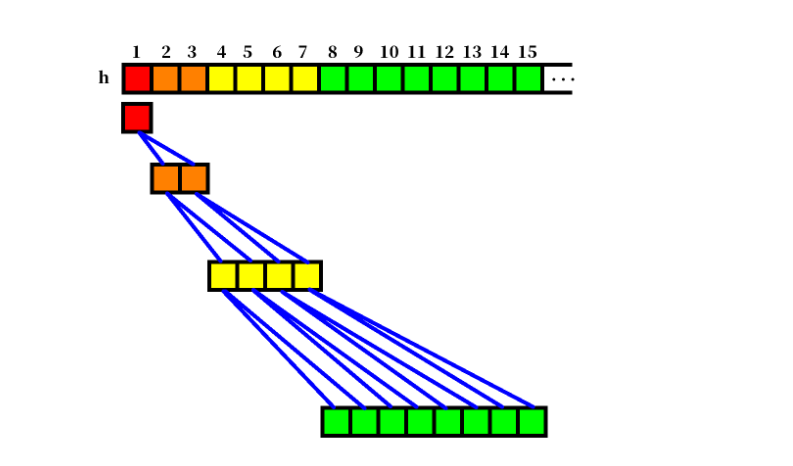
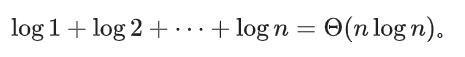
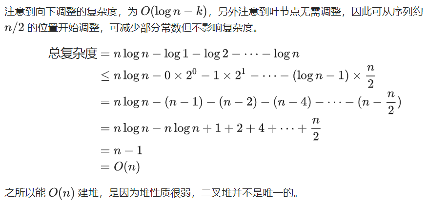

<!--
 * @Autor: violet apricity (zpx)
 * @Date: 2021-08-17 15:49:52
 * @LastEditors: violet apricity (zpx)
 * @LastEditTime: 2021-08-22 14:09:19
 * @FilePath: \apricitye:\桌面\ACM\数据结构\堆\二叉堆\二叉堆.md
 * @Description: Violet acm && Apricity:/ The warmth of the sun in the winter /
-->

# 二叉堆

## 简介

二叉堆(Binary Heap)是一颗带权完全二叉树(或者说近似完全二叉树)，同时满足堆的性质。

## 插入

选择最下层最右边的右子插入，如果慢了就新增一层，也就是插入到尾部。插入之后如果破坏了堆的性质就**向上调整**。
可以证明向上调整不会破坏其他节点的性质，时间复杂度是```O(logn)```的。

## 删除

删除指的是删除根节点。通常把尾部节点取出来，删掉根节点用它替换。然后依次从上**向下调整**。
同样可以证明向下调整不会破坏其他节点的性质，时间复杂度也是```O(logn)```的。

## 减小某个点的权值

显然找到位置直接修改后向上/下调整一次即可。

## 调整的简单实现

数组模拟一下调整的简单实现



```c++
void up(int x)
{
    while(x>1 && h[x] > h[x/2] ){
        swap(h[x] ,h[x/2]);
        x/=2;
    }
}
void down(int x)
{
    while(x*2 <=n){
        int t=x*2;
        if(t+1 <=n && h[t+1] > h[t]) t++;
        if(h[t] <=h[x]) break;
        swap(h[x] ,h[t]);
        x=t;
    }
}
```

## 建堆

考虑```1~n```全序建小根堆，如果直接插入n次，那么时间复杂度```O(nlogn)```

### 向上调整(decreasekey)

从根开始，按BFS序进行向上调整。那么对于第k层的节点向上复杂度是```O(k)```。
总复杂度：


```c++
void build_heap_1() {
  for (i = 1; i <= n; i++) up(i);
}
```

### 向下调整

假如从叶节点逐个向上调整。


```c++
void build_heap_2() {
  for (i = n; i >= 1; i--) down(i);
}
```

# 拓展：对顶堆

考虑一个有序数列，维护一个小根堆一个大根堆，大小分别为a和b。那么第a大的元素就是小根堆的堆顶。
从而可以做出拓展，即用此来维护第k大或第k小的元素。
