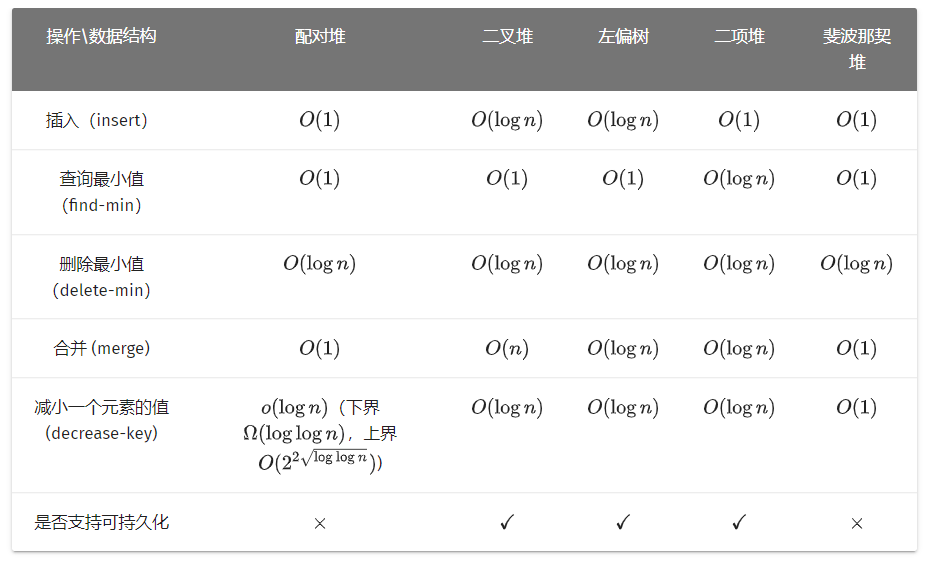
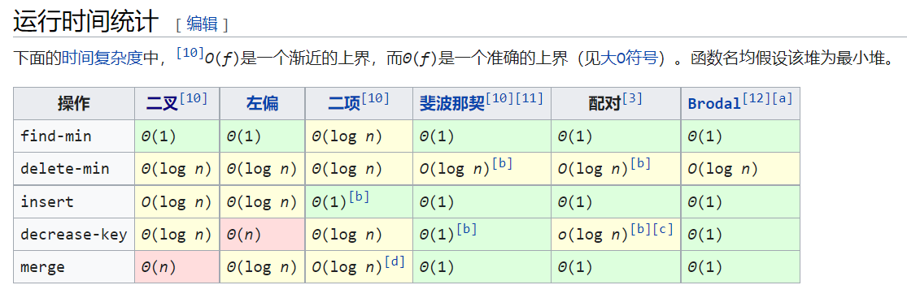

<!--
 * @Autor: violet apricity (zpx)
 * @Date: 2021-07-31 20:57:25
 * @LastEditors: violet apricity (zpx)
 * @LastEditTime: 2021-08-22 14:18:50
 * @FilePath: \apricitye:\桌面\ACM\数据结构\堆\堆简介.md
 * @Description: Violet acm && Apricity:/ The warmth of the sun in the winter /
-->

# 堆

堆是一棵树，其每个节点都有一个键值，且每个节点的键值都大于等于/小于等于其父亲的键值。
每个节点的键值都大于等于其父亲键值的堆叫做小根堆，否则叫做大根堆。STL 中的 priority_queue 其实就是一个大根堆。

（小根）堆主要支持的操作有：插入一个数、查询最小值、删除最小值、合并两个堆、减小一个元素的值。
一些功能强大的堆（可并堆）还能（高效地）支持 merge 等操作。
一些功能更强大的堆还支持可持久化，也就是对任意历史版本进行查询或者操作，产生新的版本。

