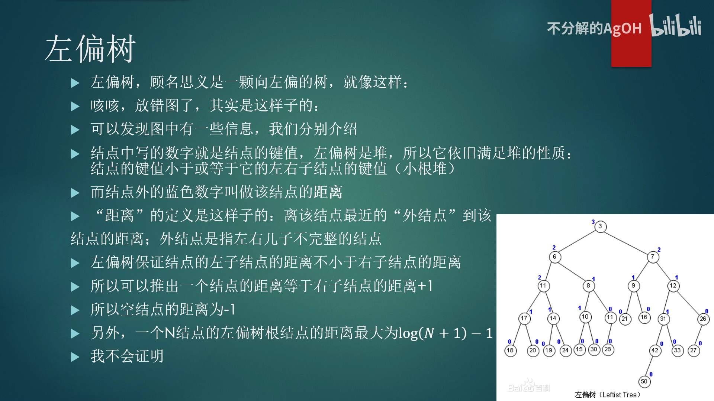
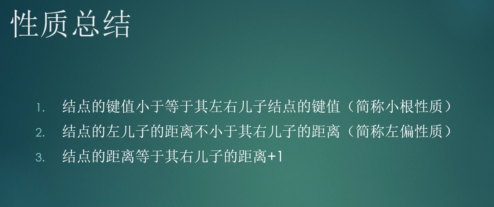

<!--
 * @Autor: violet apricity (zpx)
 * @Date: 2021-08-23 23:47:46
 * @LastEditors: violet apricity (zpx)
 * @LastEditTime: 2021-08-24 13:12:22
 * @FilePath: \apricitye:\桌面\ACM\数据结构\堆\左偏堆\左偏树.md
 * @Description: Violet acm && Apricity:/ The warmth of the sun in the winter /
-->

# 左偏树

## 简介

左偏树(leftist tree或leftist heap)和配对堆一样也是一种可并堆，具有堆的性质，支持快速合并。结构上看起来整体左偏因此称为左偏树。

左偏树是一颗二叉树，每个节点除了记录左右子树和权值之外，还有一个称为**距离**的属性。维基百科上的定义如下:

当且仅当节点 i 的左子树或右子树为空时，节点被称作**外节点**（实际上保存在二叉树中的节点都是内节点，外节点是逻辑上存在而无需保存。把一颗二叉树补上全部的外节点，则称为extended binary tree）。节点i的距离是节点 i 到它的后代中的最近的外节点所经过的边数。特别的，如果节点 i 本身是外节点，则它的距离为0;而空节点的距离规定为 -1。

简单的说，外节点就是左右儿子不完整的点，而距离则是到达子孙最近外节点的距离。

我们在维护的时候保持当前节点左子的距离大于等于右子距离，右子距离加一即为当前节点的距离。



## 性质

以小根堆为例。简单地说就是堆的性质和左偏的性质。



实例代码:

```c++
//节点
const int maxn = 1e5+5;
struct Node
{
    int l,r,fa;     //l,r分别为左右儿子编号;fa为并查集,不属于左偏树，不属于左偏树，不属于左偏树
    int val,dis;    //val为结点键值,val==-1代表结点被删除;dis为结点的距离
}ltt[maxn];         //内存池写法，与平衡树主席树相同
#define ls(x) ltt[x].l
#define rs(x) ltt[x].r
//初始化
void initltt()
{
    ltt[0].dis=-1;
    for(int i=1;i<=n;i++){
        int d;cin>>d;
        ltt[i].val=d;
        ltt[i].fa=i;
    }
}
//顺手维护并查集
int find(int x) //并查集&&路径压缩
{
    return ltt[x].fa==x?x:ltt[x].fa=find(ltt[x].fa);
}
```

## 合并

.png)

实例代码:

```c++
inline int merge(int x,int y)   //合并两堆，x,y都是堆顶元素的编号
{
    if(!x||!y) return x+y;  //如果有空的返回另一个，与fhq-Treap相同
    //  或前语句是为了维护小根堆性质，或后语句是维持(值相同则下标小的优先级高)
    if(ltt[x].val>ltt[y].val||(ltt[x].val==ltt[y].val&&x>y))
        std::swap(x,y);
    rs(x)=merge(rs(x),y);   //合并右子树和y
    ltt[rs(x)].fa=x;        //维护并查集，x的右儿子的父亲肯定是x
    if(ltt[ls(x)].dis<ltt[rs(x)].dis)   //如果不满足左偏树的性质了那就交换左右儿子
        std::swap(ls(x),rs(x));
    ltt[x].dis=ltt[rs(x)].dis+1;        //利用结点距离等于右儿子距离+1来更新dis
    return x;                           //return合并好后的堆顶结点编号
}
/*
    这种合并方式会破坏y树的结构，如果需要重新使用y树则不应该用此方法。
*/
```

## push与pop

push即插入节点，视为新树合并即可。
pop即删除根节点(堆顶)，删去之后合并子树即可。

.png)

实例代码:

```c++
//pop
inline void pop(int x)  //删除堆顶元素
{
    ltt[x].val=-1;          //值置为-1代表被删除
    ltt[ls(x)].fa=ls(x);    //维护并查集（一个结点的父亲是结点本身，代表结点没有父亲了）
    ltt[rs(x)].fa=rs(x);    //维护并查集
    // 因为路径压缩，所以可能会有除了ls(x)和rs(x)以外的结点的fa指针指向x
    // 所以要这样子写，不能让并查集断掉：
    ltt[x].fa=merge(ls(x),rs(x));
}
```

## 删除非根节点

删除节点，合并左右儿子，然后自底向上更新。

## 整个堆修改

整个堆+/-/*一个正数，维护一个懒惰标记，上传与下传即可。

## 随机合并

省去dis的计算，随机合并左右子树。

## 参考资料

[Agoh左偏树专题](https://www.bilibili.com/video/BV1eJ411S78v)

[Oiwki左偏树](https://oi-wiki.org/ds/leftist-tree/)
