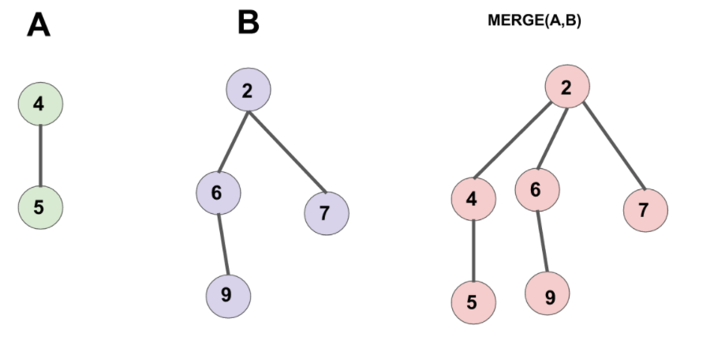
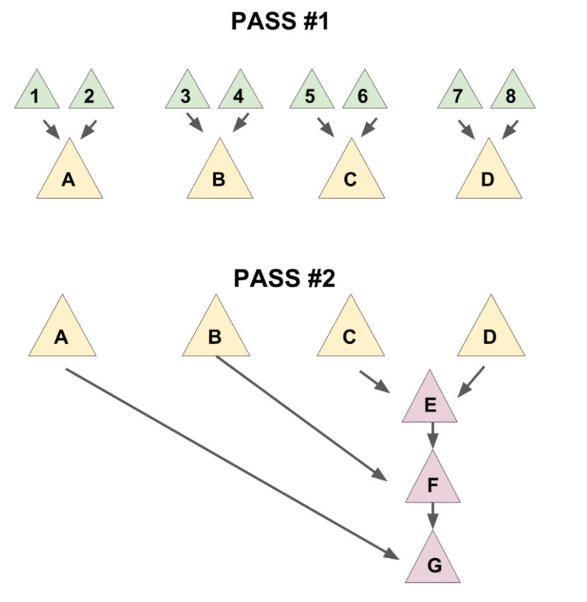
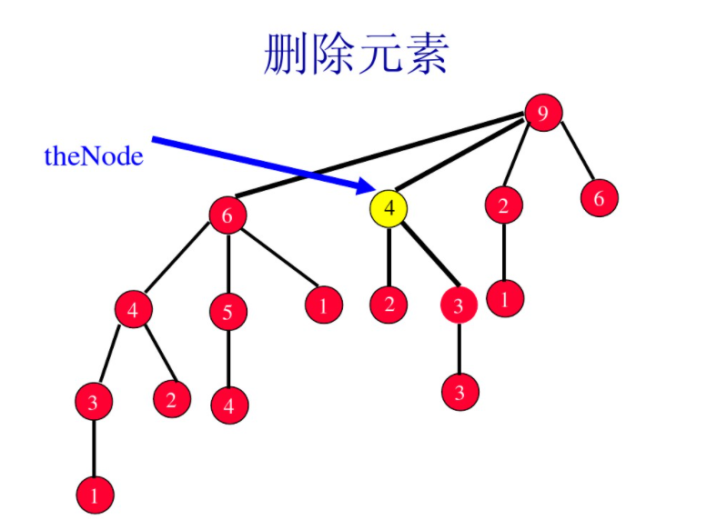
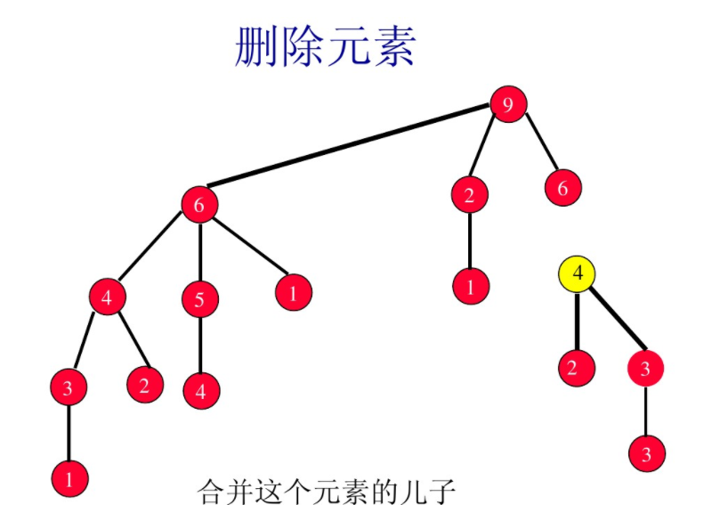
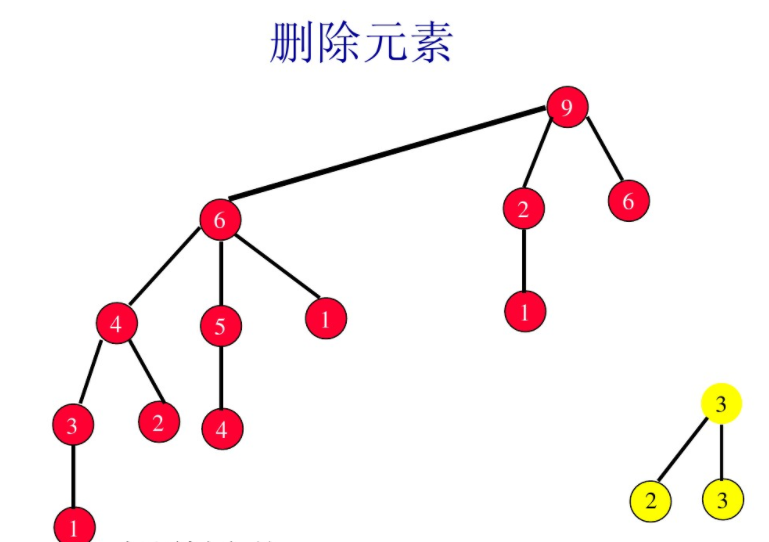
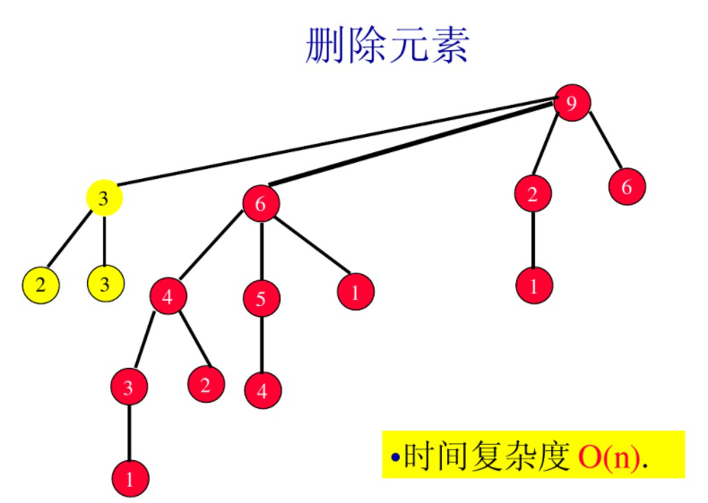

<!--
 * @Autor: violet apricity (zpx)
 * @Date: 2021-08-22 14:09:55
 * @LastEditors: violet apricity (zpx)
 * @LastEditTime: 2021-08-24 12:00:40
 * @FilePath: \apricitye:\桌面\ACM\数据结构\堆\配对堆\配对堆.md
 * @Description: Violet acm && Apricity:/ The warmth of the sun in the winter /
-->

# 配对堆/可并堆

## 简介

配对堆(可并堆)(Paring Heap)复杂度均摊，支持插入查询删除合并修改等操作。实质上是一课具有堆性质的带权多叉树，并且可以认为是简化的斐波那契堆。之所以称为配对堆，个人认为是因为其总是以配对形式进行合并与分裂。
结构上通常采用**左儿子右兄弟**的方法存储。

## 结构

节点保存**儿子**:指向儿子列表的第一个元素，**左右指针**:用双链表作为儿子列表，第一个节点的左指针指向父亲，(x是儿子列表的起点)iff(x.left.son=x)，**权值**。一般不需要记录父亲节点，度数和被切除标记。如果维护父节点，在进行值修改时会有对应的方式。
像普通的带权多叉树那样表示：

```c++
struct Node
{
    T val;
    Node *ch,*xd;
    Node *fa;
}
```

下面以大/小根堆为例描述一般操作。

## 查询最值

大/小根堆的最大/小值即根节点的值。

## 合并两个

假设合并两个小根堆，把根节点权值较大的那棵并到较小的那棵儿子里即可。



```c++
Node* merge(Node* a,Node* b) //return root
{
    if(a==NULL)return b;
    else if(b==NULL)return a;
    if(a->val > b->val) swap(a,b); //Keep a.val <= b.val
    /*b -> a.son*/
    b->xd = a->ch;
    a->ch = b;
    return a;
}
```

## 插入

插入一个新节点，直接视为一个新堆然后合并即可。
最坏的度数```n-1```，最坏的高度```n```。

## 删除根节点(堆顶)

删除堆顶后留下的儿子构成了一片森林，考虑如何将它们合并。

### 暴力合并

一次两个按顺序合并，平摊下来大概需要```O(n)```。

### 多步合并

类似地，维护一个子树队列，每次取出对头两棵树合并放到队尾，直到队列为空。时间复杂度大概也是```O(n)```。

### 两步合并

从**左往右**遍历，两两合并(若是奇数则把剩下的合并到最后一棵里)，这一步使数量减少一半，之后再**从右往左**暴力合并。复杂度均摊下来大概是```O(logn)```。



这里利用一个辅助函数实现。

```c++
Node* merges(Node* x)
{
    if(x==NULL||x->xd==NULL) return x;
    Node *a=x->xd, *b=a->xd;
    x->xd=a->xd=NULL;
    return merges(merge(x,a),merges(b));
}
```

## 删除非根节点

取出删除的节点子树，树内进行一个根节点的删除，维护之后重新和原树合并。









## 修改节点值(单点修改)

对于一个非根节点的修改，可以将其子树先分裂，对其修改维护，再重新和原树合并。对于根节点的修改，则直接修改再维护。

## 参考文献

[配对堆的论文](http://www.cs.cmu.edu/~sleator/papers/pairing-heaps.pdf)

[Oiwiki](https://oi-wiki.org/ds/pairing-heap/)

[一份中译配对堆](https://wenku.baidu.com/view/f2527bc2bb4cf7ec4afed06d.html)
